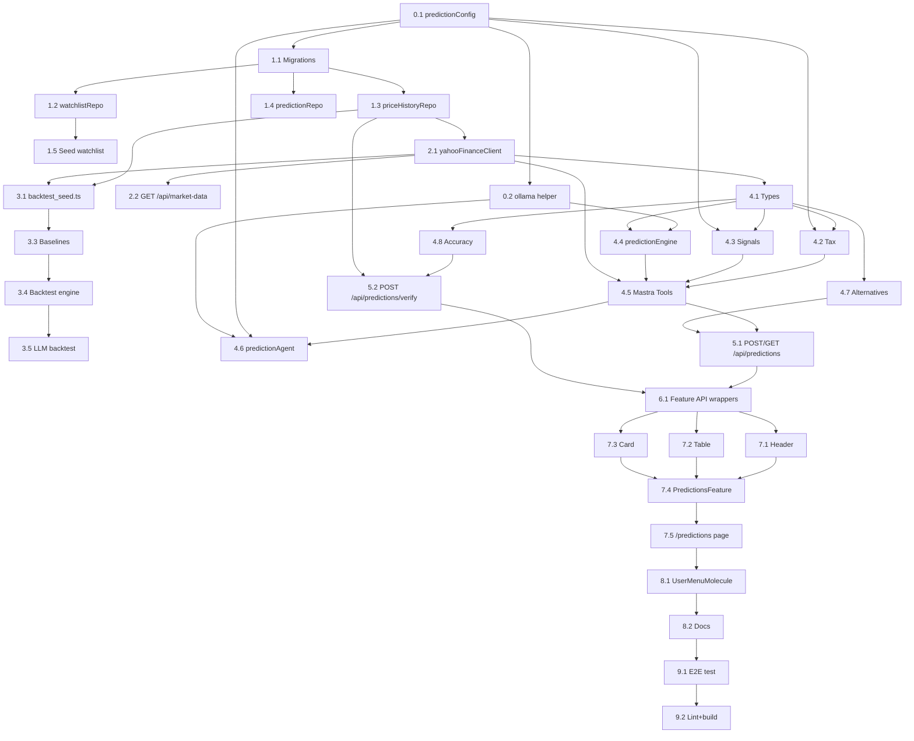

# План имплементации: Prediction Agent

> Статус: план задач для разработки.  
> Базируется на `PREDICTIONS_PLAN.md` с учётом замечаний из ревью.  
> Порядок задач оптимизирован: сначала данные и backtest, потом прод-логика, потом UI.

---

## Архитектура: Mastra Agent + createTool (Вариант A)

**Решение:** вместо MCP-сервера используем стандартный паттерн Mastra `createTool()` —
как существующий `calculateAllocationTool`. Это работает на Vercel (нет Python subprocess),
не требует `@mastra/mcp` и даёт полный контроль над промптом.

**Структура:**

```
shared/types/
  marketData.ts               ← PricePoint (разделяемый тип, FSAA-compliant)

entities/market-data/model/
  yahooFinanceClient.ts       ← чистый fetch к Yahoo API
  yahooHistoryTool.ts         ← Mastra tool-обёртка над yahooFinanceClient
  priceHistoryRepository.ts
  watchlistRepository.ts
  marketDataTypes.ts          ← WatchlistItem, YahooFinanceError (только market-data)

entities/prediction/model/
  predictionEngine.ts         ← чистая функция: промпт + callOllamaChat
  predictionEngineTool.ts     ← Mastra tool-обёртка над predictionEngine
  predictionTax.ts            ← чистая функция
  predictionTaxTool.ts        ← Mastra tool-обёртка
  predictionSignals.ts        ← чистая функция
  predictionSignalTool.ts     ← Mastra tool-обёртка
  predictionBaselines.ts
  predictionAccuracy.ts
  predictionTypes.ts          ← PredictionResult, Signal, Direction, и т.д.

features/predictions/
  agent.ts                    ← predictionAgent = new Agent({ tools: {...} })
  api/predictions.ts          ← клиентская обёртка
```

> **FSAA-важно:** `PricePoint` живёт в `shared/types/`, потому что нужен в обоих
> entity-слоях (`market-data` и `prediction`). Entities не могут импортировать друг
> из друга — только из `shared/`. Cross-entity импорт (`entities/prediction →
entities/market-data`) запрещён AGENTS.md и нарушает FSAA-матрицу.

**Паттерн (как в существующем коде):**

1. Чистая бизнес-логика в `entities/` (тестируемая, без Mastra-зависимостей).
2. Mastra tool в `entities/` обёртывает чистую функцию через `createTool()`.
3. Agent в `features/predictions/agent.ts` собирает tools вместе.
4. API route может вызывать tools напрямую (детерминированный flow) ИЛИ
   `agent.generate()` для конверсационных запросов.

> **Аналогия:** `calculateAllocation` (чистая) → `calculateAllocationTool` (Mastra) →
> `rebalancingAgent` (Agent) → `/api/chat` (вызывает логику напрямую, минуя agent).
>
> Prediction: `predictionEngine.predict` (чистая) → `predictionEngineTool` (Mastra) →
> `predictionAgent` (Agent) → `/api/predictions` (вызывает tools напрямую).

---

## Обозначения

- ✅ — можно делать параллельно с соседними
- 🔒 — блокирует последующие задачи
- 🧪 — требует ручной проверки / запуска

---

## Сводная таблица задач (33 задачи)

| #   | Этап | Название                               | Тип | Файлы |
| --- | ---- | -------------------------------------- | --- | ----- |
| 0.1 | 0    | `predictionConfig.ts`                  | 🔒  | 1     |
| 0.2 | 0    | `ollama.ts` helper                     | 🔒  | 1     |
| 1.1 | 1    | Миграции: 3 таблицы                    | 🔒  | 1     |
| 1.2 | 1    | `watchlistRepository.ts`               | 🔒  | 2     |
| 1.3 | 1    | `priceHistoryRepository.ts`            | 🔒  | 1     |
| 1.4 | 1    | `predictionRepository.ts`              | 🔒  | 2     |
| 1.5 | 1    | Seed watchlist + `/api/init-watchlist` | ✅  | 2     |
| 2.1 | 2    | `yahooFinanceClient.ts` + shared types | 🔒  | 3     |
| 2.2 | 2    | `GET /api/market-data`                 | 🔒  | 1     |
| 3.1 | 3    | `backtest_seed.ts` (TS, Yahoo → БД)    | 🔒  | 1     |
| 3.3 | 3    | Baselines (random walk + SMA)          | 🔒  | 1     |
| 3.4 | 3    | Backtest engine                        | 🔒  | 1     |
| 3.5 | 3    | LLM backtest (опционально)             | 🧪  | 0     |
| 4.1 | 4    | `predictionTypes.ts`                   | ✅  | 1     |
| 4.2 | 4    | `predictionTax.ts`                     | 🔒  | 1     |
| 4.3 | 4    | `predictionSignals.ts`                 | 🔒  | 1     |
| 4.4 | 4    | `predictionEngine.ts`                  | 🔒  | 1     |
| 4.5 | 4    | Mastra Tools (4 обёртки)               | ✅  | 4     |
| 4.6 | 4    | `predictionAgent.ts`                   | ✅  | 1     |
| 4.7 | 4    | `predictionAlternatives.ts`            | ✅  | 1     |
| 4.8 | 4    | `predictionAccuracy.ts`                | ✅  | 1     |
| 5.1 | 5    | `POST/GET /api/predictions`            | 🔒  | 1     |
| 5.2 | 5    | `POST /api/predictions/verify`         | 🔒  | 1     |
| 6.1 | 6    | Feature API wrappers (3 файла)         | ✅  | 3     |
| 7.1 | 7    | `PredictionHeaderMolecule.tsx`         | 🔒  | 1     |
| 7.2 | 7    | `PredictionTableMolecule.tsx`          | 🔒  | 1     |
| 7.3 | 7    | `PredictionCardMolecule.tsx`           | 🔒  | 1     |
| 7.4 | 7    | `PredictionsFeature.tsx`               | 🔒  | 2     |
| 7.5 | 7    | `app/predictions/page.tsx`             | 🔒  | 1     |
| 8.1 | 8    | `UserMenuMolecule` dropdown            | 🔒  | 1     |
| 8.2 | 8    | Документация                           | ✅  | 4     |
| 9.1 | 9    | Ручная проверка (smoke check)          | 🧪  | 0     |
| 9.2 | 9    | Lint + build                           | 🧪  | 0     |

**Всего файлов:** ~40 новых + 5 существующих изменены.
**Оценка:** ~34 часов.

---

## Этап 0 — Подготовка и конфигурация

### Task 0.1 🔒 — Типизированный конфиг сигналов и налогов

**Файлы:**

- `src/shared/lib/predictionConfig.ts` (новый)

**Что сделать:**

- Создать модуль с типизированной загрузкой env-переменных:
  - `SIGNAL_BUY_THRESHOLD_PCT` (default `2.0`)
  - `SIGNAL_SELL_THRESHOLD_PCT` (default `-2.0`)
  - `MOLDOVA_CAPITAL_GAINS_TAX` (default `0.12`)
  - `UCITS_WITHHOLDING_TAX` (default `0.15`)
  - `PREDICTION_MODEL` (default `qwen3:480b` — не coder)
  - `OLLAMA_BASE_URL` (default `https://ollama.com`)
  - `YAHOO_FINANCE_USER_AGENT` (default `Mozilla/5.0`)
- Все значения парсятся через `parseFloat` / `String` с fallback на default.
- Экспорт через `src/shared/lib/index.ts`? Нет — `shared/lib` не имеет barrel, импорт напрямую.

**Критерии приёмки:**

- Модуль экспортирует `predictionConfig` объект с типизированными полями.
- `getSignalThresholds()` возвращает `{ buy: number; sell: number }`.
- Юнит-тест не обязателен, но типы строгие (no `any`).

---

### Task 0.2 🔒 — Расширение `ollama.ts` для прямого fetch

**Файлы:**

- `src/shared/lib/ollama.ts` (существующий — сейчас использует `@ai-sdk/openai`)

**Что сделать:**

- AGENTS.md говорит «AI SDK removed — using direct fetch()». Но `ollama.ts` всё ещё импортирует `@ai-sdk/openai`. Проверить — если SDK используется в проде, не трогать; если нет — заменить на direct fetch helper.
- Добавить `callOllamaChat(model: string, messages: ChatMessage[]): Promise<string>` — универсальный helper для prediction engine.
- Совместимость с OpenAI-style endpoint (`/v1/chat/completions`).
- Заголовок `Authorization: Bearer ${OLLAMA_API_KEY}`.
- Парсинг `choices[0].message.content`.

**Критерии приёмки:**

- `callOllamaChat` работает с `qwen3:480b` и `gemma4:31b-cloud`.
- Не ломает существующий `ollamaConfig` (если он где-то используется).

---

## Этап 1 — База данных и миграции

### Task 1.1 🔒 — Миграции: 3 новые таблицы

**Файлы:**

- `src/shared/lib/migrations.ts` (существующий — добавить блоки)

**Что сделать:**
Добавить в `runMigrations()` после существующих таблиц:

1. **`watchlist`** — с полями из плана + новые:
   - `yahoo_symbol TEXT NOT NULL` (тикер с суффиксом биржи, `SWRD.L`)
   - `currency TEXT NOT NULL DEFAULT 'USD'`
   - `dist_policy TEXT NOT NULL DEFAULT 'acc' CHECK (dist_policy IN ('acc','dist'))`
   - `alternatives TEXT[] DEFAULT '{}'` (MVP — массив, см. Task 1.5 для отдельной таблицы)

2. **`price_history`** — как в плане, `UNIQUE(symbol, date)`, индекс `IF NOT EXISTS`.

3. **`predictions`** — как в плане + новые поля:
   - `target_date DATE` (дата, на которую делается прогноз — не только `horizon_days`)
   - `currency TEXT`
   - `mape DECIMAL(8,4)` (для верификации)
   - `baseline_predicted_price DECIMAL(12,4)` (random walk baseline для сравнения)
   - `baseline_direction TEXT CHECK (baseline_direction IN ('up','down','flat'))`

**Критерии приёмки:**

- `runMigrations()` идемпотентен (повторный запуск не падает).
- Все `CREATE INDEX` с `IF NOT EXISTS`.
- Типы `DECIMAL` конвертируются в `Number` в репозитории (как в `portfolioRepository`).

---

### Task 1.2 🔒 — Repository: `watchlistRepository.ts`

**Файлы:**

- `src/entities/market-data/model/watchlistRepository.ts` (новый)
- `src/entities/market-data/index.ts` (новый — public API)

**Что сделать:**

- `getActiveWatchlist(): Promise<WatchlistItem[]>`
- `getWatchlistBySymbol(symbol: string): Promise<WatchlistItem | null>`
- `upsertWatchlistItem(item: WatchlistItem): Promise<void>` (для seed и редактирования)
- `WatchlistItem` interface: `{ id, symbol, yahooSymbol, name, category, alternatives[], taxProfile, currency, distPolicy, isActive }`

**Критерии приёмки:**

- Паттерн идентичен `portfolioRepository.ts` (использует `query` из `@/shared/lib/db`).
- `Number()` конверсия для `DECIMAL` полей.
- Экспорт через `index.ts` barrel.

---

### Task 1.3 🔒 — Repository: `priceHistoryRepository.ts`

**Файлы:**

- `src/entities/market-data/model/priceHistoryRepository.ts` (новый)
- Обновить `src/entities/market-data/index.ts`

**Что сделать:**

- `savePriceBatch(symbol: string, prices: { date: string; close: number }[]): Promise<void>` — upsert через `ON CONFLICT (symbol, date) DO UPDATE`.
- `getPriceHistory(symbol: string, days: number): Promise<PricePoint[]>` — последние N дней, сортировка ASC.
- `getPriceOnDate(symbol: string, date: string): Promise<PricePoint | null>` — для верификации.
- `getLatestPriceDate(symbol: string): Promise<string | null>` — чтобы не ходить в Yahoo если данные свежие.
- `PricePoint` interface: `{ date: string; close: number }`.

**Критерии приёмки:**

- `savePriceBatch` использует один `INSERT ... ON CONFLICT` для всех точек (не N запросов).
- `getPriceHistory` возвращает массив, отсортированный по дате ASC.

---

### Task 1.4 🔒 — Repository: `predictionRepository.ts`

**Файлы:**

- `src/entities/prediction/model/predictionRepository.ts` (новый)
- `src/entities/prediction/index.ts` (новый — public API)

**Что сделать:**

- `savePrediction(p: PredictionRecord): Promise<number>` — возвращает id.
- `getLatestPredictions(limit: number): Promise<PredictionRecord[]>` — последние N, JOIN с `watchlist` для категории.
- `getUnverifiedPredictions(): Promise<PredictionRecord[]>` — где `verified_at IS NULL AND target_date <= CURRENT_DATE`.
- `getPredictionsBySymbol(symbol: string, limit: number): Promise<PredictionRecord[]>` — для accuracy по символу.
- `markVerified(id: number, actual: VerificationResult): Promise<void>` — обновляет `actual_price`, `actual_direction`, `direction_correct`, `error_pct`, `mape`, `verified_at`.
- `PredictionRecord` interface — все поля таблицы + computed `accuracyStats`.

**Критерии приёмки:**

- `getLatestPredictions` возвращает по одной записи на символ (последнюю), не все подряд.
- `Number()` конверсия для всех `DECIMAL`.

---

### Task 1.5 ✅ — Seed: `watchlistSeed.ts` + `/api/init-watchlist`

**Файлы:**

- `src/entities/market-data/model/watchlistSeed.ts` (новый)
- `src/app/api/init-watchlist/route.ts` (новый)

**Что сделать:**

- `WATCHLIST_SEED` массив из 7 тикеров с **исправленными yahoo_symbol**:
  - `SWRD` → `SWRD.L`, currency `USD`, dist `acc`
  - `EIMI` → `EIMI.L`, currency `USD`, dist `acc`
  - `DPYA` → `DPYA.L`, currency `USD`, dist `acc`
  - `VDTA` → `VDTA.L` (проверить — Vanguard Europe), currency `USD`, dist `dist`
  - `LQDA` → `LQDA.L`, currency `USD`, dist `acc`
  - `IDVY` → `IDVY.L`, currency `EUR`, dist `dist`
  - `GLDM` → `GLDM` (US, не UCITS — оставляем как есть), currency `USD`, dist `acc`
- `POST /api/init-watchlist` — idempotent, upsert через `watchlistRepository.upsertWatchlistItem`.
- Паттерн как `/api/init-rules/route.ts`.

**Критерии приёмки:**

- Повторный вызов не создаёт дубликаты.
- Все `yahoo_symbol` валидны (проверить через `GET /api/market-data` в Task 2.2).

---

## Этап 2 — Источник данных (Yahoo Finance)

### Task 2.1 🔒 — `yahooFinanceClient.ts`

**Файлы:**

- `src/entities/market-data/model/yahooFinanceClient.ts` (новый)
- `src/entities/market-data/model/marketDataTypes.ts` (новый — `WatchlistItem`, `YahooFinanceError`)
- `src/shared/types/marketData.ts` (новый — `PricePoint`, разделяемый тип)

**Что сделать:**

- `fetchPriceHistory(yahooSymbol: string, range: '1y' | '30d' | '7d', interval: '1d' = '1d'): Promise<PricePoint[]>`
- Endpoint: `https://query1.finance.yahoo.com/v8/finance/chart/{symbol}?range={range}&interval={interval}`
- Заголовок `User-Agent` из `predictionConfig`.
- Обработка 403/429: retry 1 раз через 2 сек, потом throw `YahooFinanceError`.
- Парсинг `chart.result[0].timestamp` + `chart.result[0].indicators.adjClose[0].adjclose`.
- `fetchQuote(yahooSymbol: string): Promise<{ price: number; currency: string }>` — текущая цена через `range=1d`.
- `PricePoint` interface: `{ date: string; close: number }` — в `shared/types/marketData.ts` (не в entities, т.к. нужен в `entities/prediction` тоже).

**Критерии приёмки:**

- Работает для `SWRD.L`, `VWCE.DE`, `GLDM`.
- При 403 бросает понятную ошибку, не падает молча.
- Возвращает пустой массив если данных нет (не null).
- `PricePoint` импортируется из `@/shared/types/marketData` — FSAA-compliant.

---

### Task 2.2 🔒 — `GET /api/market-data`

**Файлы:**

- `src/app/api/market-data/route.ts` (новый)

**Что сделать:**

- Query params: `symbol` (обязательный), `days` (default 30), `force` (default false).
- Flow:
  1. Найти `watchlist` по `symbol` → получить `yahoo_symbol`.
  2. Если `force=false` и `getLatestPriceDate(symbol)` == сегодня → вернуть из БД.
  3. Иначе `fetchPriceHistory(yahooSymbol, range)` → `savePriceBatch` → вернуть.
  4. `range`: если `days <= 30` → `30d`, иначе `1y`.
- Response: `{ symbol, days, prices: PricePoint[], source: 'cache' | 'yahoo' }`.

**Критерии приёмки:**

- Повторный вызов без `force=true` не ходит в Yahoo если данные свежие.
- При ошибке Yahoo возвращает 502 с понятным сообщением.

---

## Этап 3 — Backtest (до прод-логики прогноза)

### Task 3.1 🔒 — `backtest_seed.ts` (загрузка 1 года истории через Yahoo → БД)

**Файлы:**

- `scripts/backtest_seed.ts` (новый, Node.js скрипт, вне `src/`)

**Что сделать:**

- Запуск: `npx tsx scripts/backtest_seed.ts` (использует `tsconfig.json` paths через `tsx`).
- Для каждого тикера из `WATCHLIST_SEED` (из `@/entities/market-data/model/watchlistSeed`):
  1. `fetchPriceHistory(yahooSymbol, '1y', '1d')` → `PricePoint[]` (использует уже написанный `yahooFinanceClient` из Task 2.1).
  2. `savePriceBatch(symbol, prices)` → сохранение в `price_history` (через `priceHistoryRepository` из Task 1.3).
  3. `await sleep(500)` между тикерами — чтобы не получить rate-limit от Yahoo.
- Выводит summary: сколько строк на тикер, min/max date.
- **Один язык (TypeScript), одна среда (Node.js), без Python и без CSV-файлов.**

**Критерии приёмки:**

- 🧪 Запуск `npx tsx scripts/backtest_seed.ts` заполняет `price_history` для 7 тикеров.
- `SELECT symbol, COUNT(*) FROM price_history GROUP BY symbol` показывает ~250 на каждый.
- Повторный запуск не создаёт дубликаты (`ON CONFLICT` в `savePriceBatch`).
- При 429 от Yahoo скрипт не падает, а выводит warning и продолжает остальные тикеры.

---

### Task 3.3 🔒 — Baseline-модель: random walk + SMA-дрейф

**Файлы:**

- `src/entities/prediction/model/predictionBaselines.ts` (новый)

**Что сделать:**

- `randomWalkBaseline(currentPrice: number): { predictedPrice: number; direction: Direction }` — `predictedPrice = currentPrice`.
- `smaDriftBaseline(history: PricePoint[], horizonDays: number): { predictedPrice: number; direction: Direction }` — экстраполяция 7-day SMA дрейфа.
- Эти функции не требуют LLM, используются для сравнения в backtest и как fallback.

**Критерии приёмки:**

- Чистые функции, без side effects.
- `direction` определяется по тем же правилам ±1% что в промпте.

---

### Task 3.4 🔒 — Backtest engine

**Файлы:**

- `scripts/backtest_engine.ts` (новый, Node.js скрипт)

**Что сделать:**

- Для каждого тикера и каждой даты из `price_history` (с шагом 7 дней, начиная с 30-го дня):
  1. Взять историю до этой даты (30 дней).
  2. Посчитать `smaDriftBaseline` → predicted price.
  3. Сравнить с фактической ценой через 7 торговых дней.
  4. Записать `direction_correct`, `error_pct`, `mape`.
- Вывести summary: accuracy по символу, общий accuracy, avg MAPE.
- **Не вызывает LLM** — только baseline. Это даёт нижнюю границу для сравнения.

**Критерии приёмки:**

- 🧪 Запуск `npx tsx scripts/backtest_engine.ts` выводит таблицу:
  ```
  Symbol  BaselineAccuracy  AvgMAPE
  SWRD    0.52              2.1%
  ...
  ```
- Если baseline accuracy < 55% — фиксируем, что LLM должен beat это.

---

### Task 3.5 🧪 — Backtest LLM-модели (ручной, опционально)

**Что сделать:**

- Расширить `backtest_engine.ts` флагом `--use-llm`:
  - Для подмножества дат (каждые 30 дней, не все — экономим вызовы Ollama).
  - Вызвать `predictionEngine.predict()` (из Task 4.4).
  - Сравнить accuracy LLM vs baseline.
- Решение: если LLM не бьёт baseline → в MVP показывать только `Hold` + дисклеймер.

**Критерии приёмки:**

- 🧪 Вывод: `LLM accuracy: 0.48, Baseline accuracy: 0.52 → LLM не рекомендуется для сигналов`.
- Документировать результат в `IMPLEMENTATION_PLAN.md` (раздел «Решения по backtest»).

---

## Этап 4 — Логика прогноза (прод)

### Task 4.1 ✅ — `predictionTypes.ts`

**Файлы:**

- `src/entities/prediction/model/predictionTypes.ts` (новый)

**Что сделать:**

- `Direction = 'up' | 'down' | 'flat'`
- `Signal = 'buy' | 'sell' | 'hold'`
- `PredictionInput`: `{ symbol, history: PricePoint[], sma7, sma14, volatility, high30, low30 }` — `PricePoint` импортируется из `@/shared/types/marketData`
- `LLMResponse`: `{ predictedPrice, confidence, direction, reasoning }`
- `PredictionResult`: extends `LLMResponse` + `{ afterTaxReturnPct, signal, alternativeSymbol?, alternativeAfterTaxReturnPct?, baselinePredictedPrice, baselineDirection }`
- `PredictionRecord`: полная запись БД.
- `VerificationResult`: `{ actualPrice, actualDirection, directionCorrect, errorPct, mape }`
- `AccuracyStats`: `{ total, directionCorrect, accuracy, avgMape }`

**FSAA-проверка:** `predictionTypes.ts` импортирует `PricePoint` из `@/shared/types/marketData` — корректно (entities → shared).

---

### Task 4.2 🔒 — `predictionTax.ts` (с исправлением для убытков)

**Файлы:**

- `src/entities/prediction/model/predictionTax.ts` (новый)

**Что сделать:**

- `calcAfterTaxReturn(currentPrice, predictedPrice, distPolicy, currency): { grossReturn, afterTaxReturn, afterTaxReturnPct }`
- **Исправление из ревью:** для убытка (`grossReturn < 0`) налог не применяется:
  ```typescript
  const afterTaxReturn =
    grossReturn > 0 ? grossReturn * (1 - TAX) : grossReturn;
  ```
- Для `dist` ETF учитывать withholding tax на дивиденды (упрощённо: `afterTaxReturn *= (1 - WITHHOLDING)` только для dist, MVP).
- Конвертация валюты: если `currency !== 'USD'` — заглушка MVP (предполагаем USD-портфель, помечаем warning).

**Критерии приёмки:**

- Для `currentPrice=100, predictedPrice=110, acc` → `afterTaxReturnPct = 8.8`.
- Для `currentPrice=100, predictedPrice=90` → `afterTaxReturnPct = -10` (не `-8.8`).

---

### Task 4.3 🔒 — `predictionSignals.ts`

**Файлы:**

- `src/entities/prediction/model/predictionSignals.ts` (новый)

**Что сделать:**

- `calcSignal(direction: Direction, afterTaxReturnPct: number): Signal`
- Пороги из `predictionConfig`:
  - `buy`: `direction === 'up' && afterTaxReturnPct >= BUY_THRESHOLD`
  - `sell`: `direction === 'down' && afterTaxReturnPct <= SELL_THRESHOLD`
  - `hold`: остальное.
- `getSignalColor(signal: Signal): string` — маппинг на `colors.success/danger/warning`.

---

### Task 4.4 🔒 — `predictionEngine.ts` (промпт + Ollama call)

**Файлы:**

- `src/entities/prediction/model/predictionEngine.ts` (новый)

**Что сделать:**

- `predict(input: PredictionInput): Promise<LLMResponse>`
- Сборка промпта из плана §6.2 (30 дней + индикаторы).
- Вызов `callOllamaChat(predictionConfig.model, messages)`.
- Парсинг JSON из ответа (извлечь первый `{...}` блок regex'ом).
- Валидация: `predictedPrice > 0`, `confidence ∈ [0,1]`, `direction ∈ {up,down,flat}`.
- Fallback при ошибке: `{ predictedPrice: input.history[last].close, confidence: 0, direction: 'flat', reasoning: 'LLM unavailable' }`.
- **Минимум 14 точек истории** — иначе сразу fallback без вызова LLM.

**Критерии приёмки:**

- При пустой истории возвращает `hold` fallback без вызова LLM.
- При невалидном JSON от LLM возвращает fallback, не падает.
- Промпт содержит все индикаторы из плана.

---

### Task 4.5 ✅ — Mastra Tools: обёртки над чистой логикой

**Файлы:**

- `src/entities/market-data/model/yahooHistoryTool.ts` (новый)
- `src/entities/prediction/model/predictionEngineTool.ts` (новый)
- `src/entities/prediction/model/predictionTaxTool.ts` (новый)
- `src/entities/prediction/model/predictionSignalTool.ts` (новый)

**Что сделать:**

- Каждый tool — обёртка через `createTool()` над соответствующей чистой функцией.
- Паттерн 1-в-1 как `allocationTool.ts`:
  - `inputSchema` (Zod) — параметры вызова.
  - `outputSchema` (Zod) — типизированный результат.
  - `execute` — делегирует в чистую функцию, маппит результат.
- `yahooHistoryTool`: input `{ symbol, range }` → `fetchPriceHistory` + `savePriceBatch`.
- `predictionEngineTool`: input `{ symbol, history, indicators }` → `predict()`.
- `predictionTaxTool`: input `{ currentPrice, predictedPrice, distPolicy, currency }` → `calcAfterTaxReturn()`.
- `predictionSignalTool`: input `{ direction, afterTaxReturnPct }` → `calcSignal()`.

**Критерии приёмки:**

- Каждый tool имеет `id`, `description`, `inputSchema`, `outputSchema`, `execute`.
- `execute` не содержит бизнес-логики — только вызов чистой функции + маппинг.
- **FSAA:** tool в `entities/` импортирует только из `@/shared/` (lib, types, tokens) и из файлов внутри своего же entity-слайса. **Cross-entity импорт запрещён** — `entities/prediction/` не импортирует из `entities/market-data/`, и наоборот. Разделяемые типы (`PricePoint`) живут в `@/shared/types/`.

---

### Task 4.6 ✅ — `predictionAgent.ts` (Mastra Agent)

**Файлы:**

- `src/features/predictions/agent.ts` (новый)

**Что сделать:**

- `predictionAgent = new Agent({ ... })` — собирает все prediction tools.
- Паттерн как `rebalancingAgent` в `features/calculate-allocation/agent.ts`:
  ```typescript
  export const predictionAgent = new Agent({
    name: "ucits-prediction-agent",
    instructions: `Ты аналитик UCITS ETF...`,
    model: ollama(predictionConfig.model),
    tools: {
      get_price_history: yahooHistoryTool,
      predict_price: predictionEngineTool,
      calc_after_tax_return: predictionTaxTool,
      calc_signal: predictionSignalTool,
    },
  });
  ```
- Регистрация через `mastraConfig({ rebalancingAgent, predictionAgent })`.
- Инструкции на русском: кратко описывают когда вызывать каждый tool.

**Критерии приёмки:**

- Agent создаётся без ошибок типизации.
- `mastraConfig` принимает оба агента.
- FSAA: `features/` импортирует из `entities/` и `shared/` — корректно.

> **Примечание:** `/api/predictions` (Task 5.1) вызывает tools **напрямую**
> (детерминированный pipeline), а не через `agent.generate()`.
> Agent используется для конверсационных запросов (будущее: чат про прогнозы).

---

### Task 4.7 ✅ — `predictionAlternatives.ts`

**Файлы:**

- `src/entities/prediction/model/predictionAlternatives.ts` (новый)

**Что сделать:**

- `findBestAlternative(mainSymbol: string, mainAfterTaxReturnPct: number, alternatives: Array<{ symbol: string; afterTaxReturnPct: number }>): { symbol, afterTaxReturnPct } | null`
- Сравнивает `afterTaxReturnPct`.
- Возвращает альтернативу только если она лучше на > 0.5% (порог, чтобы не рекомендовать шум).
- Альтернативы прогнозируются в том же запуске `POST /api/predictions` (см. Task 5.1).

**FSAA-проверка:** Функция принимает **примитивный массив** `{ symbol, afterTaxReturnPct }[]`, а не `WatchlistItem[]` из `entities/market-data`. Список альтернатив и их прогнозы собираются в `features/` или `app/api/` (composition layer), которые имеют право импортировать из обоих entities.

---

### Task 4.8 ✅ — `predictionAccuracy.ts`

**Файлы:**

- `src/entities/prediction/model/predictionAccuracy.ts` (новый)

**Что сделать:**

- `verifyPrediction(prediction: PredictionRecord, actualPrice: number): VerificationResult`
  - `actualDirection` по ±1%.
  - `directionCorrect = predicted_direction === actual_direction`.
  - `errorPct = ((actualPrice - predictedPrice) / predictedPrice) * 100`.
  - `mape = abs(errorPct)`.
- `calcAccuracyStats(records: PredictionRecord[]): AccuracyStats`
  - `accuracy = directionCorrect / total`.
  - `avgMape = mean(mape)`.
- `getAccuracyBySymbol(symbol: string, lastN: number): Promise<AccuracyStats>` — через `predictionRepository.getPredictionsBySymbol`.

**Критерии приёмки:**

- Чистые функции, тестируемые без БД (кроме `getAccuracyBySymbol`).

---

## Этап 5 — API endpoints

### Task 5.1 🔒 — `POST /api/predictions` + `GET /api/predictions`

**Файлы:**

- `src/app/api/predictions/route.ts` (новый)

**Что сделать:**

**POST:**

1. `getActiveWatchlist()`.
2. Для каждого тикера:
   a. Вызвать `yahooHistoryTool.execute({ context: { symbol, range: '30d' } })` → история + сохранение в БД.
   b. Посчитать индикаторы (SMA, volatility, high/low).
   c. `smaDriftBaseline` → `baselinePredictedPrice`.
   d. Вызвать `predictionEngineTool.execute({ context: { symbol, history, indicators } })` → LLM response.
   e. Вызвать `predictionTaxTool.execute({ context: { currentPrice, predictedPrice, distPolicy, currency } })` → afterTaxReturn.
   f. Вызвать `predictionSignalTool.execute({ context: { direction, afterTaxReturnPct } })` → signal.
3. Для каждого тикера прогнозируем альтернативы (те же шаги a-f).
4. `findBestAlternative` для каждого основного.
5. `savePrediction` для каждого (основные + альтернативы).
6. Response: `{ predictions: PredictionResult[] }`.

> **Архитектура:** tools вызываются напрямую через `.execute({ context })`,
> не через `predictionAgent.generate()`. Это детерминированный pipeline —
> agent остаётся для конверсационных запросов (будущее).

**GET:**

- `?limit=50` → `getLatestPredictions(limit)`.
- Возвращает последние прогнозы с `accuracyStats` по символу.

**Критерии приёмки:**

- POST не падает если один тикер дал ошибку (продолжает остальные).
- Время выполнения < 60 сек для 7 тикеров (иначе Vercel timeout — нужен `maxDuration`).
- GET возвращает по одной записи на символ.

---

### Task 5.2 🔒 — `POST /api/predictions/verify`

**Файлы:**

- `src/app/api/predictions/verify/route.ts` (новый)

**Что сделать:**

1. `getUnverifiedPredictions()`.
2. Для каждого:
   a. `getPriceOnDate(symbol, target_date)` — из БД.
   b. Если нет — `fetchQuote(yahooSymbol)` (fallback на сегодня).
   c. `verifyPrediction(prediction, actualPrice)`.
   d. `markVerified(id, result)`.
3. `calcAccuracyStats` по всем верифицированным за этот запуск.
4. Response: `{ verified: number, accuracy: number, avgMape: number }`.

**Критерии приёмки:**

- Не ходит в Yahoo если цена уже есть в `price_history`.
- Обновляет `verified_at`, `actual_price`, `direction_correct`, `error_pct`, `mape`.

---

## Этап 6 — Feature layer (client API wrappers)

### Task 6.1 ✅ — `features/predictions/api/`

**Файлы:**

- `src/features/predictions/api/predictions.ts` (новый)
- `src/features/predictions/api/marketData.ts` (новый)
- `src/features/predictions/api/verify.ts` (новый)

**Что сделать:**

- Обёртки над `/api/predictions`, `/api/market-data`, `/api/predictions/verify` (как `explain.ts`).
- `fetchPredictions()`, `createPredictions()`, `verifyPredictions()`, `fetchMarketData(symbol, days)`.
- Типизированные ответы.

---

## Этап 7 — UI

### Task 7.1 🔒 — `PredictionHeaderMolecule.tsx`

**Файлы:**

- `src/features/predictions/ui/PredictionHeaderMolecule.tsx` (новый)

**Что сделать:**

- Заголовок «Прогнозы UCITS ETF».
- Кнопки: «Обновить прогнозы» (POST), «Проверить прогнозы» (verify POST).
- Loading state на кнопках.
- Дисклеймер-баннер: «Прогнозы носят вероятностный характер, не являются инвестиционной рекомендацией».
- Использует `ButtonAtom`, `colors`, `spacing` из design tokens.

---

### Task 7.2 🔒 — `PredictionTableMolecule.tsx` (desktop)

**Файлы:**

- `src/features/predictions/ui/PredictionTableMolecule.tsx` (новый)

**Что сделать:**

- Таблица с колонками из плана §10.1.
- Сигнал — `BadgeAtom` (Купить/Продать/Подождать).
- Reasoning — раскрывающаяся строка (details/summary или tooltip).
- Accuracy — цветной (зелёный > 60%, жёлтый 50-60%, красный < 50%).
- Сортировка по `afterTaxReturnPct` (default) и по `accuracy`.
- Inline-styles через design tokens (no Tailwind).

---

### Task 7.3 🔒 — `PredictionCardMolecule.tsx` (mobile)

**Файлы:**

- `src/features/predictions/ui/PredictionCardMolecule.tsx` (новый)

**Что сделать:**

- Карточка для одного прогноза (mobile layout).
- Скрывает reasoning, category (по плану).
- Компактный grid: цена / прогноз / доходность / сигнал.
- Использует `useIsMobile()` из `shared/lib/useMediaQuery`.

---

### Task 7.4 🔒 — `PredictionsFeature.tsx`

**Файлы:**

- `src/features/predictions/ui/PredictionsFeature.tsx` (новый)
- `src/features/predictions/index.ts` (новый — public API)

**Что сделать:**

- Композиция: `PredictionHeaderMolecule` + (`PredictionTableMolecule` | `PredictionCardMolecule`).
- `useIsMobile()` для переключения.
- Состояния: loading, error, empty.
- Загрузка прогнозов при mount через `fetchPredictions()`.
- `features/predictions/index.ts` экспортирует `PredictionsFeature`.

---

### Task 7.5 🔒 — `app/predictions/page.tsx`

**Файлы:**

- `src/app/predictions/page.tsx` (новый)

**Что сделать:**

- Server component, импортирует `PredictionsFeature` из `@/features/predictions`.
- Заголовок страницы + `UserMenuMolecule` (как на dashboard).
- Защищено middleware (уже настроено).

---

## Этап 8 — Интеграция и навигация

### Task 8.1 🔒 — Обновить `UserMenuMolecule` до выпадающего меню

**Файлы:**

- `src/shared/molecules/UserMenuMolecule/UserMenuMolecule.tsx` (существующий)

**Что сделать:**

- Заменить单一的 logout button на выпадающее меню:
  - «Дашборд» → `/`
  - «Правила» → `/rules`
  - «Прогнозы» → `/predictions`
  - «Выйти» → `signOut()`
- Использовать `useSession()` для аватара.
- Стиль: dropdown по клику, закрытие по клику вне.

**Критерии приёмки:**

- Не ломает существующие страницы (`/`, `/rules`).
- Mobile-friendly (tap target ≥ 44px).

---

### Task 8.2 ✅ — Обновить документацию

**Файлы:**

- `AGENTS.md` — добавить секцию «Prediction Agent» (кратко: фича, таблицы, endpoints).
- `README.md` — добавить `/predictions` в список страниц.
- `.env.example` (если есть) — добавить новые env-переменные.
- `PREDICTIONS_PLAN.md` — добавить ссылку на `IMPLEMENTATION_PLAN.md`.

---

## Этап 9 — Проверка и полировка

### Task 9.1 🧪 — Ручная проверка (smoke check)

> Автоматические тесты не пишутся. Это чеклист ручной проверки перед релизом —
> запустить dev-сервер, дёрнуть API, посмотреть UI. Никакого кода.

**Шаги:**

1. `npm run dev`.
2. `POST /api/init-watchlist` → проверить в БД.
3. `GET /api/market-data?symbol=SWRD&days=30` → проверить цены.
4. Запустить `npx tsx scripts/backtest_seed.ts` → проверить `price_history`.
5. Запустить `backtest_engine.ts` → зафиксировать baseline accuracy.
6. `POST /api/predictions` → проверить 7 прогнозов.
7. `POST /api/predictions/verify` → проверить верификацию.
8. Открыть `/predictions` → проверить UI desktop + mobile.
9. Проверить навигацию через `UserMenuMolecule`.

---

### Task 9.2 🧪 — Lint и build

**Команды:**

- `npx eslint src --ext .ts,.tsx` — 0 ошибок.
- `npm run build` — проходит.
- Проверить FSAA ESLint правила (новые импорты не нарушают слои).

---

## Визуализация зависимостей



---

## Оценка effort

| Этап            | Задач  | Оценка (часы) | Можно параллелить |
| --------------- | ------ | ------------- | ----------------- |
| 0 — Подготовка  | 2      | 2             | ✅                |
| 1 — БД          | 5      | 4             | частично          |
| 2 — Yahoo       | 2      | 3             | после 1           |
| 3 — Backtest    | 4      | 3             | после 2           |
| 4 — Логика      | 8      | 8             | частично          |
| 5 — API         | 2      | 4             | после 4           |
| 6 — Feature API | 1      | 1             | после 5           |
| 7 — UI          | 5      | 6             | после 6           |
| 8 — Интеграция  | 2      | 2             | после 7           |
| 9 — Тесты       | 2      | 2             | после 8           |
| **Итого**       | **33** | **~34**       |                   |

---

## Решения по backtest (заполняется после Task 3.4/3.5)

> Заполнять после запуска backtest.

- Baseline accuracy: \_\_\_
- LLM accuracy: \_\_\_
- Решение: показывать сигналы / только Hold + дисклеймер.

---

## Порядок выполнения (рекомендуемый)

1. **Task 0.1, 0.2** — конфиг и ollama helper (параллельно).
2. **Task 1.1** — миграции (блокирует всё).
3. **Task 1.2, 1.3, 1.4** — репозитории (параллельно после 1.1).
4. **Task 1.5** — seed watchlist.
5. **Task 2.1** — Yahoo клиент.
6. **Task 2.2** — market-data endpoint.
7. **Task 3.1** — загрузка истории через TS-скрипт (Yahoo → БД, без Python).
8. **Task 3.3, 3.4** — baseline + backtest engine.
9. **Task 3.5** — LLM backtest (опционально, но рекомендуется).
10. **Решение по backtest** — фиксируем, показывать ли сигналы.
11. **Task 4.1–4.4** — чистая логика (4.1 сначала, потом параллельно).
12. **Task 4.5** — Mastra tools (обёртки над 4.2–4.4 + 2.1).
13. **Task 4.6** — predictionAgent (сборка tools).
14. **Task 4.7, 4.8** — alternatives + accuracy (параллельно).
15. **Task 5.1, 5.2** — API endpoints.
16. **Task 6.1** — feature API wrappers.
17. **Task 7.1–7.5** — UI.
18. **Task 8.1, 8.2** — навигация + доки.
19. **Task 9.1, 9.2** — ручная проверка + lint/build.

---

_План составлен 2026-06-22. Каждая задача готова к выполнению независимо после разблокировки зависимостей._
